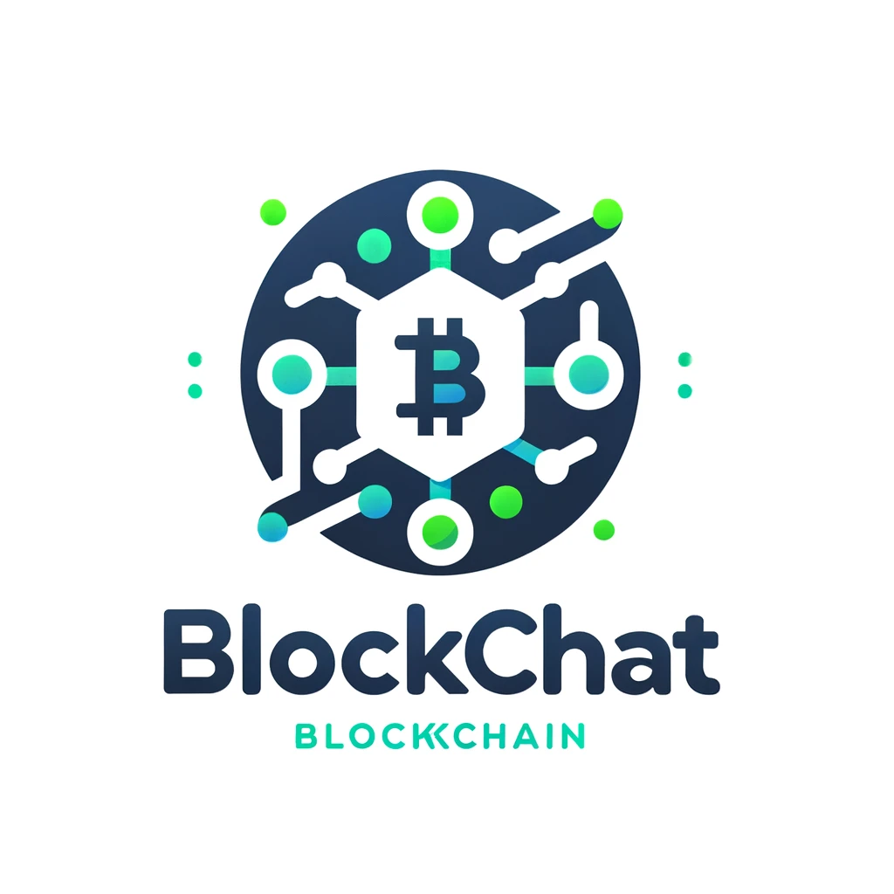

# BlockChat: A Blockchain Application in Golang

Welcome to BlockChat, a comprehensive blockchain application built entirely in Golang. This application
showcases a decentralized blockchain system with CLI and Webapp interfaces, allowing users to join the
blockchain network, send messages or Bitcoin, and engage in transactions with the assurance of a Proof
of Stake validation mechanism.

## Features

- **Blockchain Core**: A robust blockchain backend written in Go, featuring block creation, transaction handling, wallet management, and node functionality.
- **CLI Interface**: A command-line interface allowing for direct interaction with the blockchain for operations like viewing balances, making transactions, and participating in the network.
- **Web Application**: A user-friendly web interface providing access to blockchain functionalities such as account balance checks, transaction creation, and stake participation.
- **Proof of Stake**: An efficient consensus mechanism ensuring network security and block validation without the extensive energy requirements of Proof of Work systems.

## Technology Stack

- **Golang**: The entire backend, CLI, and web server are developed using Go, known for its efficiency and scalability in networked applications.
- **HTML/CSS**: For the web interface, providing a clean and accessible user experience.

## Getting Started

To set up BlockChat on your local machine, follow these steps:

1. **Clone the Repository**: Clone this repository to your local machine using `git clone`.
2. **Install Dependencies**: Navigate to each directory (`API`, `cli_client`, `webapp`) and run `go mod tidy` to install the necessary Go modules.
3. **Start the API Server**: In the `API` directory, execute `go run *.go` to start the backend server.
4. **Run the CLI Client**: Access the CLI functionalities through the `cli_client` directory by running `go run cli.go`.
5. **Launch the Web Application**: Start the web server in the `webapp` directory by executing `go run app.go`, then access the application through your web browser.

## Demo

Check out our [YouTube demo](https://www.youtube.com) to see BlockChat in action.

## Collaborators

<!-- readme: collaborators -start -->
<table>
<tr>
    <td align="center">
        <a href="https://github.com/johnpalaios">
            
             
            <b>Yiannis Palaios</b>
        </a>
    </td>
    <td align="center">
        <a href="https://github.com/ntua-el15074">
            
             
            <b>Peter Avgerinos</b>
        </a>
    </td></tr>
</table>
<!-- readme: collaborators -end -->
